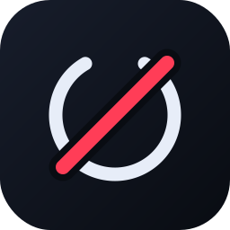

<p align="center">
  
</p>

<h1 align="center">SubKill</h1>

<p align="center">Aboneliklerini gör, gereksizini kes. Tamamen yerel çalışan masaüstü abonelik denetimi.</p>

---

Onlarca yapay zeka aracı, SaaS hesabı, API kredisi ve alan adı; her biri ayrı tarihte,
ayrı posta kutusuna. SubKill posta kutundaki makbuzları okuyup envanteri kendisi kurar,
sonra dört soruyu cevaplar:

1. Bu ay ve bu yıl ne ödeyeceğim?
2. Hangi aboneliğim bir diğerinin aynı işini yapıyor?
3. Hangi aboneliğime aylardır girmedim?
4. Hangi aboneliğim sessizce bitmiş ama hâlâ listede duruyor?

## Öne çıkanlar

- **Makbuz taraması** — IMAP üzerinden doğrudan bilgisayarından; servis adı, tutar,
  para birimi, ödeme periyodu ve yenileme tarihi çıkarılır. Birden fazla hesap bağlanabilir,
  hepsi birlikte taranır.
- **Her posta kutusu** — Gmail, iCloud, Outlook, Yandex, Yahoo, Zoho hazır ayarlarla;
  kendi alan adındaki kutular (hosting, cPanel, Plesk, kurumsal sunucu) sunucu tahminiyle.
- **Günlük otomatik tarama** — belirli aralıklarla yeni makbuz geldi mi diye bakar.
- **İptal tespiti** — iptal bildirimlerini tanır; bildirim gelmediyse yenilemesi geçmiş
  ama makbuzu gelmemiş abonelikleri işaretler.
- **Kullanım tespiti** — tarayıcı geçmişinden her servise en son ne zaman girdiğini bulur.
- **Çakışma analizi** — aynı kategorideki abonelikleri aylık yükleri ve son kullanım
  tarihleriyle yan yana koyar.
- **Deneme takibi** — ücretsiz denemeler ücrete dönmeden önce uyarır.
- **Yenileme takvimi** — 12 aylık dağılım; yıllık kalemler düştükleri ayda görünür.
- **TCMB kuru** — TL karşılıkları güncel kurla; çevrimdışıyken son bilinen kur kullanılır.

## Gizlilik

Sunucu yok, hesap yok, telemetri yok. Envanter makinendeki tek bir JSON dosyasında durur.
Posta bağlantısı doğrudan bilgisayarından kurulur; şifre işletim sisteminin
güvenli kasasında (macOS Keychain / Windows DPAPI) saklanır, veri dosyasına yazılmaz.

Servislerin **parolaları saklanmaz**. Yalnızca "bu hesaba hangi adresle, hangi yöntemle
giriyorum" bilgisi tutulur.

## Kurulum

Hazır paketler [Releases](../../releases) sayfasında: macOS için `.dmg`, Windows için `.zip`.

### Kaynaktan çalıştırma

```bash
npm install
npm start
```

npm 10+ kurulum betiklerini engelliyorsa Electron ikilisini elle indir:

```bash
node node_modules/electron/install.js
```

### Paket üretme

```bash
npm run dist:mac   # macOS .dmg (yalnızca macOS'ta)
npm run dist:win   # Windows .zip
```

macOS paketi imzasız üretilir. İlk açılışta Gatekeeper uyarı verirse uygulamaya sağ tıklayıp
"Aç" seçilir.

## Posta hesabı bağlama

Tarama sekmesine adresini yaz; sağlayıcı adresten tanınır ve o sağlayıcıya ait adımlar
ekranda çıkar.

**Gmail, iCloud, Outlook, Yandex, Yahoo, Zoho** — hesap parolası çalışmaz ve istenmez.
Sağlayıcının güvenlik sayfasından uygulamaya özel bir şifre üretilir (çoğunda önce iki
adımlı doğrulama açık olmalı). Gmail için:
[myaccount.google.com/apppasswords](https://myaccount.google.com/apppasswords).

**Kendi alan adındaki kutular (hosting, cPanel, Plesk, kurumsal)** — kullanıcı adı tam
e-posta adresi, şifre posta kutusunun kendi şifresidir. Sunucu adresten tahmin edilir
(`mail.<alanadi>` → `imap.<alanadi>` → `<alanadi>`, port 993 SSL); tahmin tutmazsa
panelde yazan adres, port ve SSL tercihi elle girilir. Port 143 girilirse bağlantı
STARTTLS ile şifrelenir.

## Testler

```bash
npm test
```

Para ayrıştırma, makbuz okuma, tarih çıkarma, çakışma tespiti, iptal tespiti, sağlayıcı
çözümleme ve takvim hesaplarını kapsayan testler.

## Mimari

```
src/core/      Electron'dan bağımsız saf mantık (test edilebilir)
  catalog.js   servis kataloğu, kategori eşlemesi
  money.js     para birimi, periyot normalizasyonu, kur çevrimi
  parser.js    makbuz ayrıştırma
  insights.js  özet, takvim, çakışma, ölü abonelik, sessiz iptal
  store.js     yerel JSON deposu
  providers.js posta sağlayıcı önayarları ve sunucu tahmini
src/services/  dış dünya (IMAP posta kutuları, tarayıcı geçmişi, TCMB kuru)
src/main.js    Electron ana süreç ve IPC yüzeyi
ui/            arayüz (vanilla JS, çerçeve yok)
web/           getsubkill.com landing sayfası ve e-posta toplama ucu
```

Ayrıntılı ürün kararları için [SPEC.md](SPEC.md).

## Lisans

MIT
